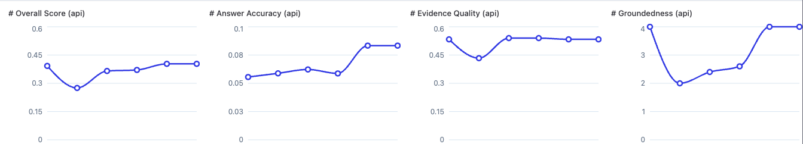

# agent-evaluation-v0

A complete **agent evaluation pipeline** — scoring a Claude-based QA agent on multi-hop questions across answer correctness, trajectory quality, and reasoning quality, all tracked in Langfuse.


## Quick Start

```bash
# 1. Install dependencies
uv pip install -r requirements.txt

# 2. Set up .env with your API keys
cp .env.example .env  # then fill in keys

# 3. Download HotpotQA + upload dataset to Langfuse
python setup_dataset.py

# 4. Run batch evaluation
python evaluate.py

# 5. Launch the demo app
streamlit run app.py
```

## How It Works

A **Claude Sonnet 4.6** agent answers 10 multi-hop questions from [HotpotQA](https://hotpotqa.github.io/) using two tools (`search_paragraphs` and `read_paragraph`). Each question is scored across **3 layers**:

| Layer | Weight | What It Measures |
|-------|--------|-----------------|
| **Answer Score** | 40% | Token F1 and exact match vs gold answer |
| **Trajectory Score** | 35% | Did it find the right evidence? (retrieval F1, action order, efficiency) |
| **Reasoning Score** | 25% | LLM-as-judge: groundedness, reasoning coherence, search strategy |

```
composite = 0.4 * answer + 0.35 * trajectory + 0.25 * reasoning
```

For detailed evaluation methodology, see [evaluation.md](evaluation.md).

## Langfuse Scores

Each run uploads **7 scores per trace** with business-friendly names:

| Score | Range | Description |
|-------|-------|------------|
| **Overall Score** | 0-1 | Weighted composite |
| **Answer Accuracy** | 0-1 | Token F1 vs gold answer |
| **Evidence Quality** | 0-1 | Trajectory composite |
| **Groundedness** | 1-5 | Is the answer backed by evidence? |
| **Reasoning Quality** | 1-5 | Does the logic make sense? |
| **Search Quality** | 1-5 | Were searches well-targeted? |
| **Human Rating** | 0 or 1 | Thumbs up/down from demo app |



## Demo App

Launch with `streamlit run app.py`:

- **Home** — visual explainer of the 3-layer evaluation
- **Dataset Explorer** — browse questions, gold answers, trajectories, context paragraphs
- **Run & Evaluate** — run the agent live, see tool calls, score all 3 layers, upload to Langfuse
- **Feedback** — thumbs up/down sent to Langfuse as `Human Rating`

## Project Structure

```
agent-evaluation-v0/
├── setup_dataset.py          # Downloads HotpotQA, uploads to Langfuse
├── agent.py                  # Claude QA agent with search/read tools
├── evaluate.py               # 3-layer batch scoring
├── rubrics/                  # LLM-as-judge scoring guides
├── app.py                    # Streamlit home page
├── pages/                    # Streamlit pages (explorer, run, feedback)
├── dataset_local.json        # Local copy of 10 dataset items
├── requirements.txt          # anthropic, langfuse>=4.0.0, streamlit, etc.
└── EVALUATION.md             # Detailed evaluation methodology
```

## Requirements

- Python 3.10+
- `uv` for package management
- Anthropic API key (agent + LLM judge)
- Langfuse account + API keys

```
ANTHROPIC_API_KEY=sk-ant-...
LANGFUSE_PUBLIC_KEY=pk-lf-...
LANGFUSE_SECRET_KEY=sk-lf-...
LANGFUSE_HOST=https://us.cloud.langfuse.com
```

## Attribution

- HotpotQA dataset: [Yang et al., 2018](https://hotpotqa.github.io/) — CC BY-SA 4.0
